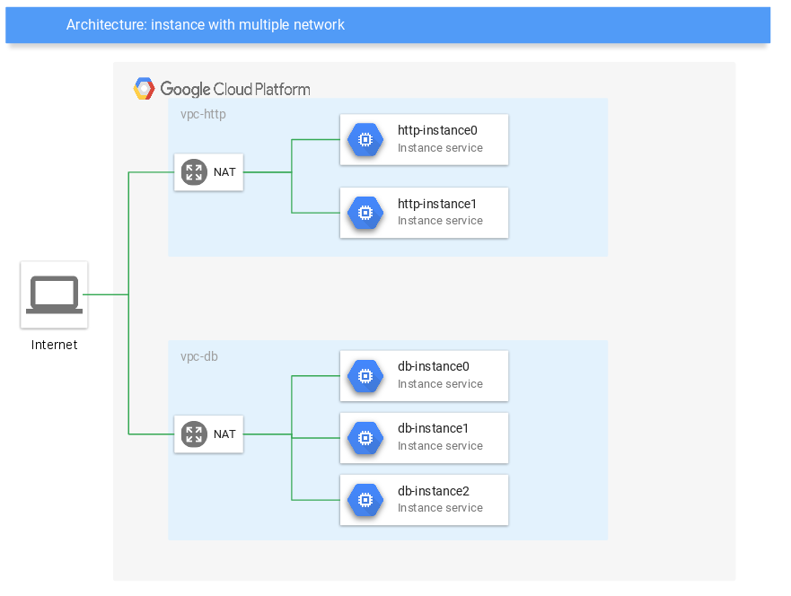

# How to



### Create stack

```
terraform apply
```

This script will create:
-   1 vpc
-   2 subnet
-   3 firewall rules
-   5 instance
-   2 public IP

### Delete stack

```
terraform destroy
```
